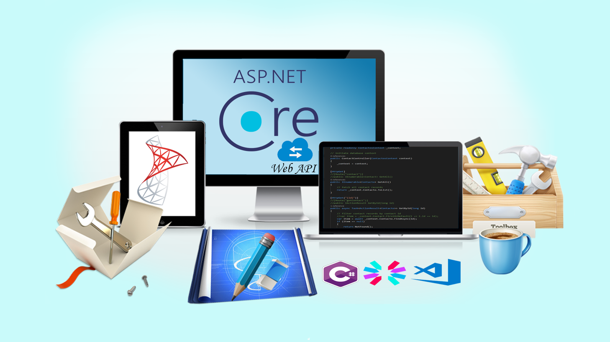


# Construye RestFul Web Api con Net Core y Visual Studio Code
##### Código Fuente del Proyecto

### 💥 Descuento de hasta 95% 💓
##### Precio $9.99 en cualquier curso

## ☷ Cursos ofrecidos con su Descuento:

☞ Desarrollo Web con Python usando Django (95%)

☞ Domina el ORM de Django (60%)

☞ Replicación de Datos con SymmetricDS (60%)

☞ Desarrolla Aplicaciones en Capa con ADO NET (87%)

☞ Entity FrameWork para principiantes (50%)

## ⚞ [Más información](http://bit.ly/mail-6-cursos-udemy) ⚟ 

## ☝ ☝ ☝ ☝ ☝ ☝ ☝☝

